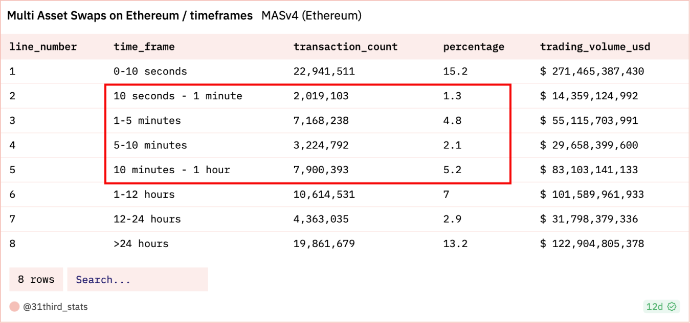
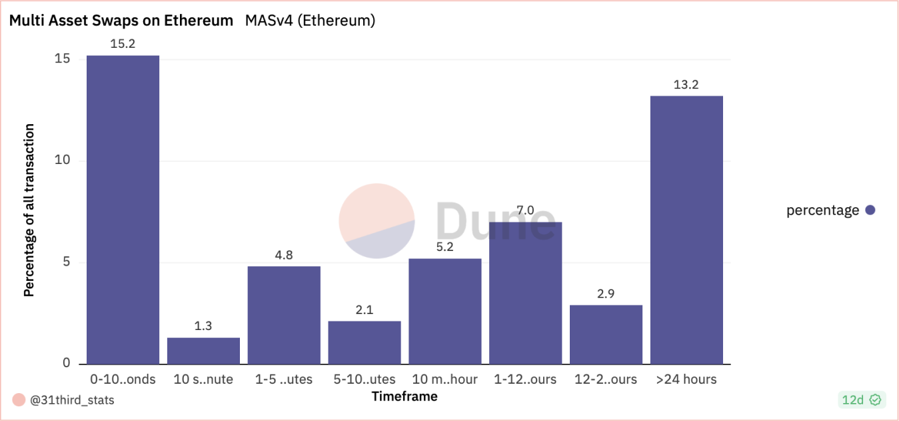
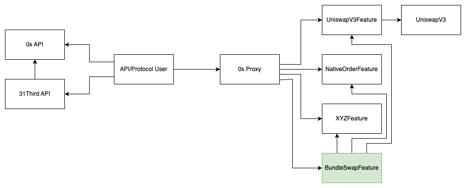

# pZEIP-1: Bundle Swap Feature (BSF) - M1

## Summary
This ZEIP aims to enhance the 0x Protocol by deploying a Bundle Swap Feature (BSF), resulting in a new feature for the 
0x Protocol core infrastructure and utility for integrators and end users. By enabling the execution of bundled trades 
in a single transaction, the BSF will streamline the process for on-chain mutual and index fund providers, reflecting 
the significant role of index funds in traditional finance within the DeFi space. This feature is restricted to ERC20 
tokens and does not support NFT orders.

## Abstract
We propose to enhance the 0x Protocol with a new contract, "BundleSwapFeature," enabling n to n swaps. This will allow 
users to bundle multiple asset trades, optimizing for efficiency and cost-effectiveness. The bundling functionality will 
serve as a foundational protocol improvement, unlocking new use cases and serving the sophisticated needs of DeFi index 
and mutual funds bringing more trading volume to 0x protocol.

An example of this is [31Thirds rebalancing functionality](https://31third.com/product/execution). This feature can then 
either be used by requesting multiple trades from the 0x API and encoding them or by using 31Thirds API.

## Motivation
In traditional finance, index funds play a pivotal role, with the largest four funds controlling a significant share of 
public company stocks. DeFi is poised for a similar trend, yet current DEX solutions do not adequately support the 
complex transactions required for portfolio rebalancing. Our analysis of Ethereum DEX trading history reveals that 13% 
of transactions could benefit from a bundling feature, indicating a clear market need for this protocol enhancement.




## Specification

### Overview
The BundleSwapFeature is accessible through the 0x Proxy like any other feature and will under the hood interact with 
other existing features:
 - MultiplexFeature
 - TransformERC20Feature
 - NativeOrdersFeature
 - BatchFillNativeOrdersFeature
 - OtcOrdersFeature
 - LiquidityProviderFeature
 - UniswapFeature
 - UniswapV3Feature
 - PancakeSwapFeature



The redirection of the separate trades can be done similarly as in MetaTransactionFeatureV2 where a call is executed 
based on the selector. The feature smart contract enables end users to leverage the multi-asset swap functionality from 
the familiar 0x Protocol trading environment.

### Rationale
Features follow an architecture described in the [0x Protocol docs](https://docs.0xprotocol.org/en/latest/architecture/features.html). 
Based on this documentation and discussions with 0xSHA we develop the feature as described in [Overview](#overview).

The name “BundleSwapFeature” is open for discussion. Any input on what fits best into the 0x ecosystem is very welcome.

### Technical Specification
The feature will receive an array of trades containing `calldata` (like returned from the 0x quote endpoint) and 
additional configurations. It will also receive a property `errorBehaviour` which defines what happens if one of the 
trades fails (e.g. because it's expired or slippage was exceeded).

A `Trade` is specified similar to `MetaTransactionsFeatureV2#ExternalTransformERC20Args`:

```solidity
struct Trade {
  IERC20Token inputToken;
  IERC20Token outputToken;
  uint256 inputTokenAmount;
  uint256 outputTokenAmount;
  bytes data;
}
```

The `ErrorBehaviour` enum is specified as follows:

 - REVERT: As soon as one trade fails the whole tx reverts.
 - STOP: As soon as one trade fails the tx stops, but already executed trades stay executed.  
   The input token of the failed trade is returned to the user's wallet. If the returnable amount is not exactly the 
   same as `inputTokenAmount` the whole tx reverts as well.
 - CONTINUE: If an error occurs the execution jumps to the next trade.  
   The input token of the failed trade is returned to the user's wallet. If the returnable amount is not exactly the 
   same as `inputTokenAmount` the whole tx reverts as well.

```solidity
enum ErrorBehaviour {
  REVERT,
  STOP,
  CONTINUE
}
```

Similar to `MetaTransactionsFeatureV2#_executeMetaTransactionPrivate` trades will be redirected to other features 
defined by the selector of `data`.

## Security Considerations
Security audit to be performed by a tier-one firm, such as Certik, Quantstamp or Hacken.

## Notes
Work packages are defined as follows.

### WP1 Protocol-Level Integration
Develop a feature smart contract (BundleSwapFeature) to extend the 0x Protocol core infrastructure with the multi-asset 
swaps functionality.

### WP2 Pair-reviewing with 0xSHA
After implementing an initial prototype, Sha and 31Third will do pair reviews of the developed source code. Findings of 
this process will be incorporated into future development. Sha will also support 31Third for technical discussions and 
pair-reviewing of future code states.

### WP3 Automated Integration Tests
Develop a sophisticated suite of tests, including automated tests for all use cases (centring around MAP) with several 
different tokens. These tests can be run automatically during development and within a CI/CD pipeline to ensure the 
newest changes operate seamlessly with already implemented features.

### WP4 Documentation
Create comprehensive documentation for integration partners, outlining the necessary steps and best practices for 
incorporating the new functionalities into their applications.

### WP5 Project Management and Testing
Thorough testing and quality assurance of the integrated solution from a project and product management perspective. 
This includes conducting various testing scenarios, identifying and resolving issues or bugs, and ensuring the smooth 
functioning of the multi-asset swap functionality as part of the 0x Protocol core infrastructure.

Optional: The testing phase can be executed in collaboration with the 0x Protocol product and technical development 
teams to ensure all requirements and objectives are met before the final release.

### WP6 Audit process support
The work package only covers the 31Third resources required to support the auditors while performing the audit.

### WP7 Audit
Security audit to be performed by a tier-one firm, such as Certik, Quantstamp or Haken.

## Team
The 31Third team has a track record of developing blockchain-native trading and asset management infrastructure, which 
was achieved under the 31Third umbrella. Furthermore, we were incubated by Techstars and ABN AMRO and Outlier Ventures.

Before venturing into the DeFi space, our team members worked with tier-one hedge funds, spearheaded IT infrastructure 
projects for one of the largest European banks, founded successful Web2 startups that served thousands of B2B clients 
and developed award-winning AI applications.

Due to building on 0x (Protocol and API) for more than a year, the 31Third team is highly familiar with 0x protocol.

## Point of Contact
Philipp ([philipp@31third.com](mailto:philipp@31third.com))

## Funding Requested
We estimate a total cost of $ 89.000. $64.000 for internal resources and $25.000 for a 3rd party audit.

We are planning to split the project into the following phases (Milestones):
 1) Proof of concept (POC) (WP1, WP2)
 2) Finalization and Testing Phase (WP1, WP3, WP4)
 3) Bug fixing, documentation and audit preparation (WP1, WP3, WP5)
 4) Audit and go- live (WP6)

We are requesting $ 25.000 to start implementing the POC.