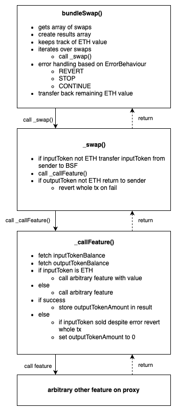

# pZEIP-1: Bundle Swap Feature (BSF) - M2

This document consists of three parts. Firstly a summary of the initial proposal. Secondly, the report of the work that
has been done in milestone 1 and findings that have emerged. Lastly, the description of what will be done in milestone 2
including deliverables, expected delivery date and funding request.

## Summary

This ZEIP aims to enhance the 0x Protocol by deploying a Bundle Swap Feature (BSF), resulting in a new feature for the
0x Protocol core infrastructure and utility for integrators and end users. By enabling the execution of bundled trades
in a single transaction, the BSF will streamline the process for on-chain mutual and index fund providers, reflecting
the significant role of index funds in traditional finance within the DeFi space. This feature is restricted to ERC20
tokens and does not support NFT orders.

To understand the whole context refer to [pZEIP: Bundle Swap Feature (BSF) - M1](./1_BUNDLE_SWAP_FEATURE_M1.md) which is
the original proposal for milestone 1 of this pZEIP.

## Report of Milestone 1

We finalized milestone 1 which included conception and development of a proof of concept smart contract. We also
developed a basic test suite to test the functionality of bundling swaps of features like UniswapV3, TransformERC20,
OtcOrders.

The conception phase included analyzing the existing protocol to gather information about different options to integrate
the BSF. After that, a proof of concept smart contract was developed. In parallel a basic test suite was developed to
test the functionality of the proof of concept BSF. Included test cases are e.g. m:n swaps including UniswapV3 and OTC
orders.

We have been in communication with SHA during the development process and we ran through review cycles together.

From a high-level the implementation looks as shown in the following graphic:

**The developed code can be seen in the GitHub
diff:** https://github.com/0xProject/protocol/compare/development...Phips0812:0x-protocol:m1

## Technical Issues

During the development and discussion while executing milestone 1 the following 2 technical issues have emerged:

#### ERC20 vs native currency

The proof of concept implementation (see GitHub diff) has one entry point bundleSwap() which can handle ERC20 and the
native currency as in and output. For being able to support the native currency there is a specific logic to handle the
difference between native and ERC20 tokens. Additional entry points that can either handle the native currency or just
ERC20 tokens could be implemented to optimize gas efficiency.

#### Arbitrary internal calls to proxy

During discussions from [SHA-2048](https://github.com/SHA-2048) and [gabririgo](https://github.com/gabririgo), related
to [pZEIP-2](./2_BATCH_MULTIPLEX_FEATURE.md) (developed by gabririgo), it was figured out that internal arbitrary
calls back to the proxy can lead to harmful interactions since some internal functions are registered on the proxy and
could therefore be called by attackers to steal approved user funds.

More technical details on both topics can be found
in [pZEIP-1 - M2: Technical Details](./1_BUNDLE_SWAP_FEATURE_M2_TECHNICAL_DETAILS.md).

## Milestone Roadmap Adaption

The initial milestone roadmap can be seen in [pZEIP: Bundle Swap Feature (BSF) - M1](./1_BUNDLE_SWAP_FEATURE_M1.md).
We’ve been able to finish more work than expected in Milestone 1. Due to the findings described in the section “Report
of M1” above there is some additional effort required. So the overall project effort estimation stays as planned in the
initial proposal:

Planned Milestones:

1. [X]  Proof of concept
2. [ ]  Finalize smart contract, Extend test suite
3. [ ]  Documentation, Audit preparation
4. [ ]  Audit and go-live

## Milestone 2

Milestone 2 is focused on the finalization of the BundleSwapFeature contract. The findings described in “Report of M1''
will be incorporated into the new and final proposed version. In addition the already partly existing testsuite will be
extended to cover use cases for the most important subcalls to other features.

## Deliverables

* Final proposed version of the BundleSwapFeature
    * Including resolutions for the issues described in [Technical Issues](#technical-issues)
* Testsuite including Forge integration tests for:
    * TransformERC20
    * Native Orders
    * OTC Orders
    * Uniswap V2
    * Uniswap V3

## Expected delivery date

6 weeks after pZEIP approval.

## Funding Request

We are requesting $ 25.000 for the implementation of Milestone 2
