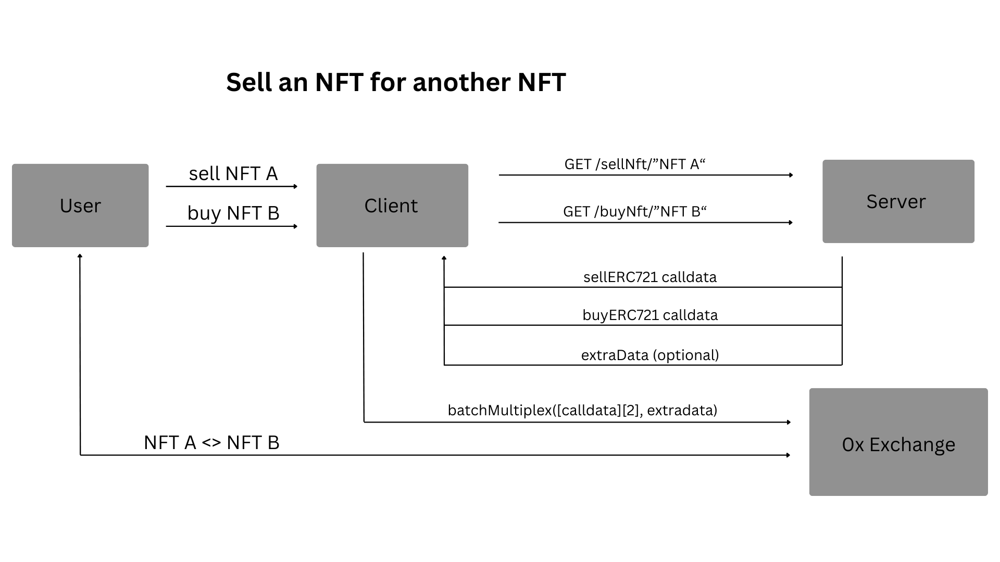
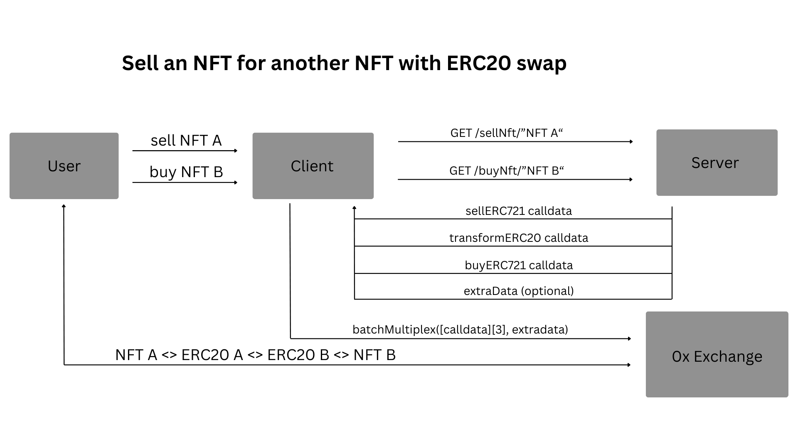

## Summary
To allow swaps of ERC20 tokens to NFTs, NFTs to NFTs, and vice versa; bundles of ERC20 tokens to NFTs, ERC20 tokens to bundles of NFTs and vice versa.

## Abstract
The proposed feature will allow the execution of swaps of bundles of tokens and NFTs. It will allow applications and service providers to offer new features with their existing infrastructure and minimal server-side work.

## Motivation
Currently, the 0x Exchange Proxy allows executing bundles of meta transactions and multiple transactions for a single token.
However, it does not allow for multiple tokens to be swapped for one or many tokens in a single transaction, and it does not support buying an NFT with any token. The new feature will open new use cases for the 0x Exchange Proxy with minimal modifications. The community has expressed interest in such a feature. There is demand from service providers to offer bundle NFT and ERC20 to NFT transactions.

## Specification

### Overview
- A new smart contract extension is added to the Exchange Proxy.
- The new contract exposes three new methods, which will allow the execution of multiple swaps at the same time.
- The new methods do not implement swap logic, thus never bypassing the security checks of the 0x protocol.
- In order to achieve this, either:
  - some methods will either be explicitly prevented from being used (i.e., publicly exposed private methods) or
  - only specific methods will be allowed.
  In this context, it will be important to assert that the addition of new methods to the exchange proxy won't
  result in an attack vector, either by reverting in the contract or in the unit tests.
- The `batchMultiplex` method will not impose any new types on the Exchange Proxy, therefore resulting in an easier way to
    support it at an API level.
- The `batchMultiplex` method will optionally validate the transaction against a validator contract. This feature will be
    developed as a complement for those projects that require extra validation, but without imposing project-specific
    code on the 0x Exchange Proxy. A sample validator contract with an explanation of how to decompose an encoded transaction will be provided. The validation will be executed through a staticcall, therefore not allowing arbitrary code execution.
- The `batchMultiplex` method will optionally have specific behavior on error: `STOP`, `REVERT`, `CONTINUE`. In order to do that, it will define a new `enum` in the IBatchMultiplex interface:
    ```
    enum ErrorHandling {
        REVERT,
        STOP,
        CONTINUE
    }
    ```

### Rationale
The proposed approach has a series of positives:
- exact same format as the 0x stack.
- minimal changes for service providers.
- no new type definitions for compatibility.
- minimal implementation logic for augmented security.
- possibility of bundling a token swap with an NFT swap, i.e., buying an NFT with ZRX.

The proposed implementation is also fully compatible with the existing tech stack:
- a client can make multiple requests to an API provider and batch the returned calls in a BatchMultiplex format. This will work from day 1.
- a service provider can provide a BatchMultiplex endpoint, returning an array of swap transactions to the client. The client would then format the BatchMultiplex transaction by adding the txns array and the optional extraData as inputs. The amount of work required to the service provider is minimal, as, besides requesting the type of transactions, no additional return values are required compared to the original swap calldata.
- a service provider will provide data as specified, but the client will add some `extraData` for on-chain validation.

### Technical Specification
New contracts created:
1) IBatchMultiplex, the interface;
2) BatchMultiplex, which will override IBatchMultiplex's public methods.

The IZeroEx interface will inherit the new methods from the IBatchMultiplex contract. The IBatchMultiplex interface will use the [NatSpec Format](https://docs.soliditylang.org/en/latest/natspec-format.html) for documentation. The BatchMultiplex will inherit the documentation, thus being exposed in the contract artifacts.

```
interface IBatchMultiplex {
  enum ErrorHandling {
    REVERT,
    STOP,
    CONTINUE
  }

  function batchMultiplex(bytes[] calldata data) public returns (bytes[] memory results);

  function batchMultiplex(
    bytes[] calldata data,
    bytes calldata extraData,
    address validatorAddress
  ) external returns (bytes[] memory results);

  function batchMultiplex(
    bytes[] calldata data,
    bytes calldata extraData,
    address validatorAddress,
    ErrorHandling errorType
  ) external returns (bytes[] memory results);
}
```

The returned message will be the array of messages returned by the single transactions, which will either be the returned
message from the 0x Exchange calls or the message returned during the optional error handling.

The BatchMultiplex contract will also implement an internal method that will optionally validate the inputs. Validation will be delegated to an arbitrary contract, which will return a boolean. The transaction will revert if the returned value is not `true`. The validation will be performed by using `staticcall`, therefore eliminating the possibility of the original transaction making changes to the state during validation.

An external validator contract (i.e., an external application) implements a validate method:
```
function validate(bytes calldata dataPackage) external view returns (bool isValid)
```
and is able to decode the `dataPackage` according to its own specific data format specifications.
Alternatively, the `dataPackage` input can be substituted with a more explicit input, which will save 1 encoding at the
0x protocol call, i.e.:
```
  function validate(
    bytes[] calldata calls,
    bytes calldata extraData,
    address sender
  ) external view returns (bool isValid) {
```
where `calls` is an array of 0x swap calldata, `extraData` is an arbitrary string (can also be an array of strings for single-swap-transaction validation) added by the client, and `sender` is the address sending the transaction (i.e., the address executing the swap transactions).
Both methods are implemented in an example contract, and during the peer-review process, it will be assessed which one is the most effective.

#### Example of an NFT to NFT swap
Definitions: The `Client` is any user-facing application or tool. The `Server` is a remote application or service provider that aggregates liquidity like the 0x API.

Example 1: a user wants to swap one NFT for another NFT.


Example 2: a user wants to swap one NFT for another NFT, but the NFT orders are made with different tokens. A further ERC20 transformation is required under the hood.

In the 0x protocol format, this is required when `sellOrder.erc20Token` is different from `buyOrder.erc20Token`

Notice: the `Server` may return additional calldata. These transactions are to be added to the array of calldata. In case the `Server` returns `params` (including a method's selector), it is the task of the `Client` to encode `params` to `calldata`, a pretty standard process for sending batched transactions. In order for the displayed transactions to succeed, the value of NFT A shall equal at least the value of NFT B plus exchange, protocol, affiliate, or relayer fees.

## Security Considerations
The proposed design does not impose specific conditions and should not create new attack vectors. Therefore, it should not be controversial once proposed as a formal ZEIP (which will be voted on by the community). However, as some of the specifications may 1) not be deemed necessary at launch and 2) result in an audit requirement, which would not otherwise be needed for a simpler implementation, the more sophisticated methods will be subject to community vetting.

## Notes
As a community delegate, I hold substantial voting power. I will abstain from using my votes for this proposal, as I am in a
position of conflict of interest.
This proposal is a complement to pZEIP1. While pZEIP1 is solely focused on enabling swaps of bundles of ERC20 tokens, this proposal is broader in scope, and some of its results could potentially be incorporated by pZEIP1, which is expected to be shipped over a longer timeframe.

## Team
Gabriele Rigo, founder of [RigoBlock](https://rigoblock.com/), a protocol for token management, and a 0x bootstrap community delegate. He holds extensive knowledge of smart contract development, testing, working with proxy contracts and libraries. He built the first integration of an offchain orderbook and an onchain protocol for asset management in 2018, which used a fork of the 0x protocol for allowing smart-contract delegated signatures.

## Point of Contact
Gab gab@rigoblock.com

## Funding Requested
The project's total budget is 30,000 USD and comprises:
1) two weeks Research & Discovery (3,000 USD)
2) three weeks Development (16,000 USD)
3) one week Testing and peer review (3,000 USD)
4) one week Documentation, code amendments after peer review (3,000 USD)
5) posting the official ZEIP on github, pushing code to the 0x Github repo via pull request, full support and amendments to code as agreed during peer-review, preparation for audit
6) support for audit and code fixes thereafter (in case audit is requested) (5,000 USD)

The request is for 25,000 USD, which includes all listed points besides point 6.
If the community requests an audit, the funding amount related to point 6 will be requested. The audit process will be coordinated with the 0xLabs and 0xPathways teams.
